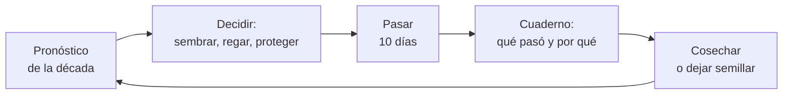
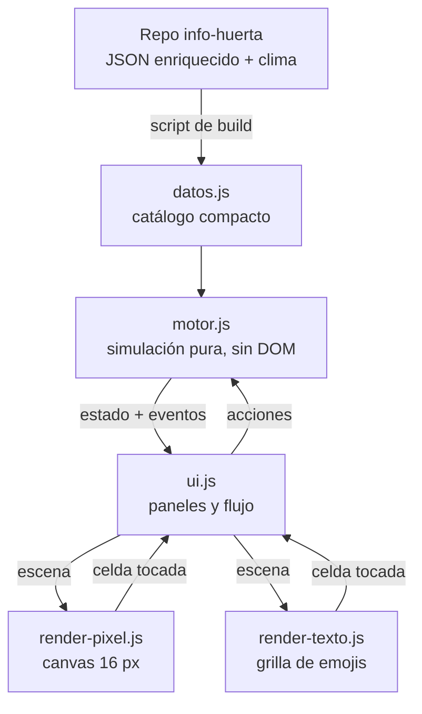

# Huertita — documento de diseño del juego

2026-09-17 · @Someone

## Concepto y pilares

Huertita es un simulador de huerta urbana agroecológica del Gran Buenos Aires donde las reglas del juego son las de la huerta real: lo que aprendés jugando te sirve con tierra en las manos. Nombre de trabajo; se puede cambiar.

El jugador recibe un patio chico en el conurbano, con un paredón que da sombra, un bancal, unas macetas y una almaciguera. Juega un año calendario por décadas de 10 días, la misma unidad que usa INTA y que ya usa huertapp. Cada partida dura 36 turnos, unos 25 a 40 minutos.

Cuatro pilares ordenan cada decisión de diseño:

- **Verdad agronómica.** Ningún número del juego es inventado si el repo tiene el dato: ventanas de siembra, días de germinación, horas de sol, heladas, asociaciones. Lo que es supuesto propio se marca como supuesto, igual que en `clima-gba.mjs`.
- **Causa visible.** Cuando algo sale mal, el juego dice por qué, con la frase real de la ficha. Una lechuga que espiga en enero enseña más que un tutorial.
- **Decisiones, no tareas.** El tiempo del jugador se va en elegir qué, dónde y cuándo; no en hacer clic para regar 40 veces.
- **Perder es barato.** Una planta muerta cuesta un sobre de semillas y deja una lección en el cuaderno. Eso invita a experimentar.

El público son dos personas a la vez: quien quiere arrancar una huerta y no se anima, y quien ya tiene una y quiere probar sin costo lo que en la vida real tarda un año en responderse.

## ¿Esto ya existe? Minecraft y el resto

No: Minecraft tiene cultivos, pero no tiene huerta. Su agricultura es un sistema de producción de comida para sobrevivir, deliberadamente abstracto, y ninguna de sus reglas enseña algo trasladable a una huerta real.

Minecraft es un mundo de bloques en 3D donde se explora, se construye y se sobrevive. Plantar es una actividad entre cien. En el juego base un cultivo necesita tres cosas: nivel de luz 9 o más (una antorcha alcanza), tierra arada con agua a 4 bloques o menos, y tiempo. No hay estaciones, ni heladas, ni tipos de suelo, ni plagas, ni plantas que se lleven mal. El trigo crece igual en enero que en julio. Hay dos guiños interesantes: alternar hileras de cultivos distintos acelera el crecimiento, y las abejas que pasan sobre un cultivo lo hacen avanzar una etapa ([wiki de Minecraft](https://minecraft.wiki/w/Tutorials/Crop_farming)).

Los mods de la comunidad se acercan más. El que más lejos llega es [TerraFirmaCraft](https://terrafirmacraft.github.io/Field-Guide/18/en_us/mechanics/crops.html): cada cultivo tiene su rango de temperatura e hidratación, el suelo tiene nitrógeno, fósforo y potasio, las trepadoras piden tutor y la planta madura que se deja pasar da semillas. Serene Seasons agrega estaciones. Aun así siguen siendo cultivos extensivos genéricos dentro de un juego de supervivencia, en inglés, para PC, y con clima de fantasía.

|  | Minecraft base | Minecraft + mods realistas | Huertita |
| --- | --- | --- | --- |
| Centro del juego | Construir y sobrevivir | Supervivencia dura | La huerta es todo el juego |
| Calendario y estaciones | No hay | Estaciones genéricas | 36 décadas con normales del SMN |
| Heladas | No hay | Temperatura por bioma | Probabilidad real de FAUBA por zona del GBA |
| Luz | Umbral único, sirve una antorcha | Igual | Horas de sol por celda y por estación |
| Suelo | Un solo tipo | Nutrientes NPK | 5 categorías, materia orgánica, compost |
| Asociaciones | Alternar hileras acelera | No | Buenas y malas por especie, con fuente |
| Almacigo y trasplante | No | No | Sí, con ventana y señales de plantín listo |
| Semillas propias | Siempre sobran | Al dejar pasar la planta | Decisión: comer o dejar semillar |
| Sirve para aprender huerta | No | Apenas | Es el objetivo |

Entre los juegos de granja, Stardew Valley es el más querido y tiene estaciones, pero cada cultivo solo pertenece a una estación y crece en días fijos: es agenda, no agronomía. Farming Simulator simula maquinaria y escala industrial. Garden Life es jardinería ornamental contemplativa. Grow a Garden, el fenómeno de Roblox de 2025, es un juego de esperar y coleccionar. No encontré ninguno que combine huerta chica, reglas agroecológicas reales y clima de una región concreta.

Ese hueco es la oportunidad. Y la ventaja difícil de copiar no es el código: es la base de 55 especies con fuentes e índice de confianza que ya armaste.

## Loops de juego

El juego es por turnos y cada turno es una década de 10 días: mirás el pronóstico, gastás tus ratos, pasás la década y leés qué pasó. Por turnos y no en tiempo real porque en el celular se juega de a ratos, y porque la huerta real también es mirar, decidir y esperar.

El recurso escaso no es la plata, son los **ratos**: 14 por década. Sembrar una celda cuesta uno, trasplantar uno, poner mulch uno. El riego no se hace a clic: se elige un régimen por cantero (nada, espaciado, parejo, constante, la misma escala del repo) y ese régimen descuenta ratos solo. En enero regar todo "constante" te deja sin tiempo para sembrar, salvo que hayas puesto mulch o goteo. Esa tensión es la de la vida real.

| Escala | Duración | Qué decide el jugador | Qué lo trae de vuelta |
| --- | --- | --- | --- |
| Turno | 1 a 2 min | En qué gastar 14 ratos | El pronóstico: ¿hiela?, ¿llueve? |
| Cultivo | 3 a 15 turnos | Qué sembrar, dónde y al lado de qué | Ver germinar, la primera cosecha |
| Temporada | 9 turnos | Relevos: qué entra cuando sale el tomate | Pedidos de vecinos con fecha |
| Año | 36 turnos | Rotación, suelo, semillas propias | El balance del año y el patio siguiente |

La partida arranca en la década 22, principios de agosto. Es el mejor comienzo dramático: todavía hiela, pero ya hay que hacer el almácigo protegido de tomate si querés trasplantar en octubre.

## Sistemas de simulación

Cada planta crece según el producto de cinco factores entre 0 y 1: luz, agua, temperatura, suelo y vecinos. El jugador los ve como cinco barritas en la ficha de la planta, y ahí está casi toda la enseñanza del juego.

La tabla dice de qué campo de `huerta_gba_enriquecido.json` o de `clima-gba.mjs` sale cada sistema, y qué parte es supuesto propio del juego.

| Sistema | Cómo funciona en el juego | Dato del repo | Supuesto propio |
| --- | --- | --- | --- |
| Calendario | 36 décadas. Sembrar en ventana ideal, posible o fuera de época cambia el vigor | `calendario.decadas.conurbano` | Vigor 1 / 0,85 / 0,6 |
| Temperatura | Normal de la década más una anomalía al azar. Olas de calor y frío | Normales SMN de Ezeiza; `temperaturas.crecimiento` | Desvío de la anomalía |
| Heladas | Probabilidad por década. Muere, sufre, aguanta o mejora según la especie | Fechas y desvíos FAUBA; `temperaturas.helada` | Frecuencia dentro de la temporada |
| Germinación | No nace si el suelo está fuera de rango; la semilla se pierde a los 30 días | `dias_germinacion`, `temperaturas.germinacion` | Suelo igual a la media del aire, como en el repo |
| Luz | Horas de sol por celda: el paredón norte sombrea más en invierno; el árbol caduco solo en verano | `luz.horas_min`, `horas_ideal` | Geometría de sombras del patio |
| Agua | Régimen de riego por cantero, más lluvia, menos calor. Las macetas se secan antes. Exceso también daña | `riego.regimen` | Balance hídrico simplificado; lluvia aproximada |
| Suelo | 5 categorías y materia orgánica 0 a 100 que baja con cada cosecha y sube con compost y mulch | `suelo.categoria_suelo` | Cuánto pesa cada desajuste |
| Contenedores | Bancal a suelo, bancal elevado, macetas de 4, 8 y 20 litros, almaciguera protegida, microtúnel | `maceta.medidas` | Efecto térmico del microtúnel |
| Almácigo y trasplante | Plantín listo entre los días mín y máx. Trasplantar lo que no lo tolera lo daña | `dias_a_trasplante`, `metodo_por_mes` | Daño por trasplante |
| Asociaciones | Vecinos en las 8 celdas de alrededor suman o restan | `asociaciones.buenas` y `malas` | +8 % y −12 % por vecino |
| Polinizadores | Las flores abiertas suben el cuaje de los frutos. Bajo microtúnel no entran | Grupo "Flor polinizadora", cuidado `polinizacion` | Curva de cuaje |
| Plagas | Pulgones, orugas y babosas según época y lluvia. Flores y aromáticas cerca bajan el riesgo | Texto de `plagas` | Probabilidades |
| Rotación | Repetir familia botánica en la celda frena y enferma; después de legumbres, mejora | Cuidado `rotacion` | Tabla de familias (botánica estándar) |
| Cosecha | Única o escalonada según el grupo. Si no cosechás a tiempo, se pasa | `dias_a_cosecha`, `cosecha.indicadores_listo` | Porciones por cosecha |
| Semillas propias | Dejar semillar ocupa la celda 3 décadas más y devuelve sobres adaptados a tu patio | `longevidad` | +5 % de vigor por generación |
| Compost | Los restos de cosecha cargan la compostera; madura en unos 120 días, más rápido en verano | `compostaje.json`, `listo_desde.dias` | Rendimiento por tanda |

Regla heredada del repo: **el juego puede simplificar, nunca contradecir**. Si una ficha dice que la zanahoria no se trasplanta, en el juego tampoco conviene. Donde el repo tiene `confianza` baja, el efecto en el juego es más suave.

Dos mecánicas reales que quedan fuera del v0 y entran después: el espacio que ocupa cada planta (un zapallo no es una lechuga) y el fotoperíodo, que es lo que de verdad hace espigar a la lechuga y bulbificar a la cebolla.

## Diseño para que enganche

El riesgo de este juego es ser una planilla con dibujitos. Lo evita una sola idea: cada regla real tiene que aparecer como una decisión interesante, nunca como un requisito a memorizar.

**El fantasma de siembra.** Al elegir un sobre, todo el patio se pinta de verde, amarillo o rojo según qué tan bien le iría a esa especie en cada celda hoy: luz, suelo, maceta, vecinos y época. El jugador aprende explorando, sin leer. Es la mecánica más importante del juego.

**El cuaderno que explica.** Todo lo que pasa entre turnos queda escrito con su causa: "La albahaca murió: heló (mín. 1 °C) y no tolera heladas. Un microtúnel la habría salvado". El juego nunca castiga en silencio.

**Información imperfecta.** El pronóstico da rangos y probabilidades, no certezas. Tapar o no tapar con 40 % de riesgo de helada es una apuesta chica y frecuente, que es lo que mantiene despierto un juego por turnos.

**Progresión por desbloqueo de complejidad.** El primer año arranca con 8 especies nobles (rabanito, lechuga, acelga, arveja, perejil, caléndula) y un patio chico. Los logros abren especies más difíciles, el microtúnel, el goteo, la compostera grande y, al cerrar el año, patios nuevos con otro problema cada uno.

**Recompensas en tres plazos.** A los 2 turnos germina algo. A los 4, el primer rabanito. A los 10, la ensalada completa. El rabanito de 25 días existe en la vida real exactamente para esto: es el cultivo que le da la primera alegría al principiante.

**Pedidos de vecinos.** "Doña Rosa quiere 3 plantas de lechuga para fines de octubre." Dan dirección sin tutorial, tienen fecha, y pagan con sobres de semillas raras o un esqueje de romero. Son el trueque de la feria del barrio, sin plata.

**Dificultad que viene del clima, no de trampas.** Cada año sortea su carácter: Niña seca, Niño llovedor, helada tardía, verano de olas de calor. El mismo plan no sirve dos veces, y eso da rejugabilidad.

**Balance final con estrellas.** Porciones cosechadas, especies distintas, semillas guardadas, salud del suelo y visitas de polinizadores. Premia la diversidad por encima del monocultivo, que es el mensaje agroecológico dicho con puntos.

## Ideas más allá del pedido

- **Modo "mi patio".** El jugador carga su patio real: orientación, paredes, horas de sol por sector. El juego pasa a ser un simulador de su propia huerta antes de gastar en tierra.
- **Puente con huertapp.** Lo que plantás en el juego se puede exportar como plan a la app, y la huerta real de la app se puede importar como partida. Comparten base de datos y modelo de décadas.
- **Fecha real.** Un modo que arranca en la década de hoy y sugiere lo que toca sembrar ahora en el GBA. Juego y almanaque a la vez.
- **Semillas con linaje.** Cada sobre guardado lleva generación y origen. Se intercambian por código o QR entre jugadores: una feria de semillas digital.
- **Bichos con nombre.** Vaquitas de San Antonio, crisopas y avispitas como fauna coleccionable que aparece si hay flores y refugio. El álbum de bichos enseña control biológico.
- **Las tres hermanas** y otras asociaciones clásicas como combos con nombre y bonus: choclo, chaucha y zapallo están los tres en el repo y se llevan bien entre sí.
- **Preparados agroecológicos.** Purín de ortiga, jabón potásico, trampa de cerveza para babosas. Ningún producto de síntesis, igual que el catálogo.
- **Modo aula.** Escenarios cortos de 6 a 9 turnos con una sola lección cada uno, pensados para una clase de 40 minutos: "salvá el almácigo de la helada", "diseñá un bancal sin enemigos".
- **Cocina.** La cosecha desbloquea recetas veganas de estación. Cierra el ciclo de la semilla al plato y conecta con tu recetario.
- **Modo contemplativo.** Sin puntaje ni pedidos, solo el patio y las estaciones, para quien quiere jugar a regar.

## Arquitectura

Tres capas con dependencias en un solo sentido: los datos no saben del motor, el motor no sabe que existe una pantalla, y el renderer solo recibe una foto del estado y devuelve toques. Cambiar la gráfica es escribir otro renderer de tres métodos.

El motor es una función de estado: `despachar(estado, acción)` y `pasarDecada(estado)` devuelven eventos, y todo el estado es un JSON serializable. El azar sale de un generador con semilla guardada en el estado. De ahí salen gratis el guardado, las partidas reproducibles, los tests sin navegador y, más adelante, un bot que juegue mil años para balancear.

El contrato del renderer es mínimo: `montar(elemento)`, `dibujar(escena)` y `alTocar(callback)`. La escena es un objeto plano que arma la UI: celdas con su tipo, planta, etapa, salud y tinte de fantasma; clima y estación. El prototipo trae dos renderers intercambiables con un botón, el pixel-art y uno de texto, para probar que el contrato alcanza. Un renderer isométrico, uno en Three.js o uno nativo entran por la misma puerta.

Stack recomendado para después del prototipo: TypeScript, el motor como paquete sin dependencias con Vitest, y la UI como PWA con Vite, el mismo camino que huertapp. Para llevarlo a tiendas, Capacitor sobre esa PWA alcanza; si algún día pide más músculo gráfico, el motor se reusa tal cual desde React Native con Skia o desde Phaser. No hace falta backend: partida local, igual que la app.

## El prototipo v0

El [prototipo jugable](https://claude.ai/artifact/4qfBdRJGaRFdEjczwVLq4q) ya corre un año completo con las 55 especies del repo, y el código quedó en la carpeta `huertita-juego`, al lado de `info-huerta`. Se juega en el celular o abriendo `dist/huertita.html` con doble clic.

Incluye: el patio de 8 por 9 con paredón norte y árbol caduco, cuatro tipos de cantero, fantasma de siembra, almácigo y trasplante, riego por régimen con costo en ratos, pronóstico con error, heladas, manta y microtúnel, asociaciones, polinizadores, tres plagas con control biológico, rotación, mulch, compostera, semillas propias con generación, espigado por calor, ocho logros que abren especies, cuaderno, balance con estrellas y guardado local. El botón "Gráfica" cambia entre el renderer pixel-art y el de texto en caliente.

Lo que simplifica a propósito: una planta por celda sin importar su tamaño, macetas fijas, sin pedidos de vecinos, sin feria, un solo patio, sin sonido, y cuidados como raleo, aporque y poda todavía no son acciones.

Un bot juega la partida sin navegador (`node tools/bot.js`). Con 200 años simulados, la frecuencia de décadas con helada da 85 % en julio, 46 % a fines de septiembre, 25 % a principios de octubre y 3 % a mediados de noviembre, coherente con la fecha media de última helada de FAUBA para Ezeiza, 5 de octubre. El mismo bot, que siembra siempre en la mejor celda, saca entre 70 y 165 puntos según el año que le toque.

Tres cosas a mirar al jugarlo, porque son decisiones de diseño abiertas: si 14 ratos por década se sienten escasos o sobran, si el doble toque para sembrar molesta, y si el cuaderno explica lo suficiente cuando algo muere.

Agregado después. La v0.2 subió la resolución a 32 px, sumó animaciones, tres cámaras (cenital, oblicua y cantero de cerca con corte de suelo) y la tira de estadíos. La v0.3 sumó la almaciguera real (cada siembra son varias semillas, nacen más o menos según las condiciones, se ralea o se repica de a un plantín), los indicadores con la banda del rango que pide cada especie, el almanaque de 36 décadas y la ficha completa.

## Roadmap y próximo paso

El próximo paso es uno solo y corto: jugar un año entero en el celular y anotar dónde te aburriste y dónde no entendiste por qué pasó algo. Con esas notas se decide la etapa 1; planificar más antes de eso no suma.

| Etapa | Objetivo | Entra | Esfuerzo estimado |
| --- | --- | --- | --- |
| 0. Prototipo | Probar que el loop divierte | Lo que ya está | Hecho |
| 1. Diversión | Que den ganas de jugar el segundo año | Pedidos de vecinos, balance con el bot, tamaño de planta, macetas móviles, raleo y poda, sonido, animaciones de cosecha | 3 a 4 semanas |
| 2. Verdad | Que un huertero no encuentre errores | Fotoperíodo, variedades del repo, revisión de cada supuesto contra fuentes, fichas con fuente y confianza dentro del juego | 3 semanas |
| 3. Producto | Instalable y con progresión larga | TypeScript y tests del motor, PWA, patios nuevos, años con carácter, álbum de bichos, tutorial por logros | 4 a 6 semanas |
| 4. Puentes | Que juego y app se alimenten | Modo "mi patio", import y export con huertapp, modo aula, feria de semillas por código | 4 semanas |

Los plazos suponen una persona a tiempo parcial con asistencia de IA, y son estimaciones gruesas. Cada etapa termina en algo jugable, así que se puede frenar en cualquiera.

Riesgos a vigilar: que la simulación crezca más rápido que la diversión (la etapa 1 va antes que la 2 por eso), que los supuestos propios contradigan al catálogo sin que nadie lo note (el bot y un test de "el juego nunca contradice al repo" lo cubren), y que el pixel-art hecho a código se quede corto (el contrato del renderer permite cambiarlo por sprites dibujados sin tocar el motor).

## Mapa de ideas

Las ideas se ordenan en cuatro cuadrantes con nombre de huerta, para poder decir "eso es un rabanito" y entendernos. El eje horizontal es el costo de hacerlo; el vertical, cuánto le suma a la jugabilidad y al aprendizaje.

|  | Costo bajo | Costo alto |
| --- | --- | --- |
| **Impacto alto** | **Rabanitos**: rápidos y rinden. Se hacen ya. | **Zapallos**: tardan y ocupan lugar, pero llenan la mesa. Se planifican de a uno. |
| **Impacto bajo** | **Aromáticas**: fáciles, dan sabor, no llenan la olla. Se intercalan cuando hay un hueco. | **Yuyos**: consumen recursos y no dan. Se dejan, por ahora. |

Dónde cae cada idea. "Vos" marca las tuyas; el resto son mías. El costo supone los cimientos ya hechos (última sección); sin ellos, varios rabanitos se vuelven zapallos.

| Idea | De | Cuadrante | Por qué ahí |
| --- | --- | --- | --- |
| Almácigo con varios plantines, raleo y repique | Vos | Rabanito, hecho en v0.3 | Era un cambio de modelo chico y enseña una práctica real |
| Indicadores con rango deseable | Vos | Rabanito, hecho en v0.3 | Los datos ya estaban; la barra ahora explica el porqué |
| Almanaque y ficha completa | Vos | Rabanito, hecho en v0.3 | Puro dato del repo puesto en pantalla |
| Más eventos sorpresa | Vos | Rabanito | Con los eventos como tabla de datos, cada uno nuevo cuesta minutos |
| Césped y poda como secos y verdes del compost | Vos | Rabanito | La receta 2 secos por 1 verde ya está en `compostaje.json`; suma un recurso finito más |
| Pedidos de vecinos con fecha | Yo | Rabanito | Dan objetivo de corto plazo, que hoy falta después del logro 8 |
| Sonido y ambiente | Yo | Rabanito | Lluvia, pájaros, el "pop" de la cosecha: mucho disfrute por poco código |
| Patios prediseñados (balcón, terraza, fondo grande) | Vos | Rabanito, con cimientos | Si el patio es un dato, cada patio nuevo es un archivo |
| Vacaciones de enero y otros desafíos con fecha | Yo | Rabanito | Un evento que obliga a preparar mulch y goteo enseña más que diez textos |
| Jugar de a 1 a 10 días | Vos | Zapallo | Toca el corazón del motor y obliga a rebalancear todo |
| Feria vecinal: vender o trocar verdura | Vos | Zapallo | Necesita economía, precios, tienda y balance; le da sentido al excedente |
| Editor del espacio | Vos | Zapallo | Interfaz de edición más sombras calculadas por geometría |
| Tamaño real de cada planta y marcos de plantación | Yo | Zapallo | Un zapallo ocupa 4 celdas, caben 9 rabanitos en una: convierte el bancal en rompecabezas |
| Diagnóstico por síntomas | Yo | Zapallo | Pide dibujar síntomas por especie; es el "¿qué le pasa a mi tomate?" hecho juego |
| Modo "mi patio" y puente con huertapp | Yo | Zapallo | Convierte el juego en simulador de tu huerta real |
| Fauna viva y álbum de bichos | Yo | Aromática | Vaquitas, crisopas, sapo, picaflor: suma disfrute; la mecánica ya existe |
| Preparados agroecológicos (purín de ortiga, etc.) | Yo | Aromática | Variante del "tratar plaga" que ya hay |
| Tanque de agua de lluvia y goteo como mejoras | Yo | Aromática | Pesa sobre todo en años Niña |
| Recetas veganas de estación y conservas | Yo | Aromática | Cierra semilla-plato; no cambia cómo se juega |
| Variedades del repo (tomate determinado, zanahoria corta) | Yo | Aromática | El dato existe; suma opciones, no mecánicas |
| Árboles frutales | Vos | Yuyo, por ahora | No hay datos con fuente y su escala es de años, no de una temporada |
| Fotoperíodo detallado | Yo | Yuyo, por ahora | Muy real, pero el jugador casi no lo vería y falta investigarlo |
| Cámara isométrica o 3D | Yo | Yuyo | La vista de cerca ya da el disfrute; esto sería un renderer entero |
| Feria de semillas en línea entre jugadores | Yo | Yuyo | Requiere servidor y moderación; se puede simular con códigos QR más adelante |

Frutales merece una aclaración: no es mala idea, es cara de hacer bien. El camino barato es un solo frutal ya plantado en algún patio (un limón, por ejemplo) como elemento de sombra y cosecha de invierno, recién cuando investigues esas fichas para huertapp.

Orden sugerido: cimientos, después los rabanitos pendientes en una sola tanda, y recién ahí un zapallo por vez. El primer zapallo sería el tiempo de 1 a 10 días, porque condiciona el balance de todo lo demás.

## Mis cinco propuestas

Las cinco apuntan a lo mismo: que cada regla real se vuelva una decisión con consecuencias visibles. Van en el orden en que las haría.

**1. Pedidos de vecinos con fecha (rabanito).** "Doña Rosa necesita 3 lechugas para fines de octubre." Hoy, después del octavo logro, el juego se queda sin objetivos de corto plazo. Un pedido obliga a contar días hacia atrás con la ficha en la mano, que es exactamente planificar una huerta. Pagan con sobres raros, compost o herramientas, y son la semilla de la feria vecinal que proponés.

**2. Vacaciones de enero y otros desafíos anunciados (rabanito).** Dos décadas sin poder tocar nada, avisadas con un mes de anticipación. Quien puso mulch, agrupó macetas a la sombra y dejó goteo vuelve a una huerta viva; quien no, aprende por qué se hace. Es el uso más fuerte de los recursos finitos que ya tenés.

**3. Tamaño real de planta y marcos de plantación (zapallo).** Hoy una celda aloja igual a un zapallo que a un rabanito. Con tamaños, un zapallo invade 4 celdas, en una entran 9 rabanitos o 4 lechugas, y el choclo le hace sombra a lo que tiene al sur. El bancal pasa a ser un rompecabezas espacial, que es lo que es.

**4. Diagnóstico por síntomas (zapallo).** En vez de decirte "le falta agua", la planta lo muestra: hojas amarillas desde abajo, tallo ahilado, puntas quemadas, fruto con la punta podrida. El jugador elige la causa entre tres opciones; si acierta, el tratamiento cuesta menos ratos. Es la pregunta "¿qué le pasa a mi tomate?" de huertapp convertida en juego, y entrena el ojo, que es lo más difícil de enseñar en huerta.

**5. Patio vivo: sonido y fauna (rabanito más aromática).** Lluvia que suena, benteveo a la mañana, el "pop" de la cosecha. Y bichos con nombre que llegan si hay flores, agua y refugio: vaquitas, crisopas, abejorros, un sapo que come babosas, un picaflor en la salvia. Con un álbum para completarlos. No cambia las reglas: cambia las ganas de abrir el juego.

Otras que anoté y están en el mapa: preparados agroecológicos, tanque de lluvia y goteo, recetas de estación y conservas, variedades del repo, modo "mi patio".

## Eventos sorpresa

Hoy no hay eventos sorpresa de verdad: los regalos de la vecina son el premio fijo de los 8 logros, y lo único azaroso es el clima (helada, ola de calor, lluvia, el carácter del año) y las plagas. La sensación de sorpresa funciona, así que conviene construir el sistema en serio.

Regla de diseño: todo evento tiene una respuesta que es una práctica real de huerta, y los malos se anuncian o se pueden prevenir. Frecuencia: uno cada 3 o 4 décadas, nunca dos malos seguidos. Los marcados con (r) se apoyan en datos del repo; el resto es conocimiento general de huerta y necesita revisión tuya antes de entrar.

| Evento | Cuándo | Qué pasa | Respuesta que enseña |
| --- | --- | --- | --- |
| **Regalos** |  |  |  |
| Kit de semillas de temporada | Marzo y septiembre | Llegan sobres de otoño-invierno o primavera-verano | Sembrar en fecha (r) |
| La vecina trae plantines | Octubre | 3 plantines de tomate o morrón listos | Trasplantar en ventana, después de la última helada (r) |
| Esqueje de aromática | Cualquier momento | Romero, menta o lavanda para plantar | Las perennes se multiplican por esqueje |
| Bolsas de hojas secas | Otoño | +secos para el compost o mulch gratis | Relación secos y verdes (r) |
| Lombrices de regalo | Primavera | La compostera madura más rápido | Lombricompuesto |
| Cajón de verdulería | Cualquier momento | Un contenedor nuevo para ubicar | Reutilizar; profundidad según especie (r) |
| Cañas del vecino | Primavera | Tutores gratis por una temporada | Tutorado (r) |
| **Clima** |  |  |  |
| Granizo | Primavera y verano | Daña hojas y frutos descubiertos | Manta o microtúnel |
| Sudestada o viento fuerte | Todo el año | Voltea plantas altas sin tutor | Tutorar a tiempo (r) |
| Helada fuera de pronóstico | Septiembre y octubre | Cae sin aviso, con baja probabilidad | No adelantar el trasplante (r) |
| Semana de lluvia | Otoño y primavera | Babosas y hongos; suelo encharcado | Trampas, drenaje, no regar de más (r) |
| Corte de agua | Verano | Una década sin riego | Mulch, tanque de lluvia |
| **Bichos y animales** |  |  |  |
| Hormigas cortadoras | Primavera y verano | Pelan una planta en una noche | Barreras y cebos caseros |
| Pájaros | Tras sembrar o con frutilla madura | Se comen semillas o frutos | Red, ramas sobre el surco |
| El gato escarba | Tras sembrar | Desarma un almácigo o un surco | Cubrir con ramas o malla |
| Mariposa blanca | Verano y otoño | Orugas en todas las brasicáceas a la vez | Revisar el envés; flores cerca (r) |
| Llegan las vaquitas | Con flores abiertas | Limpian los pulgones del patio | Flores que atraen aliados (r) |
| Se instala un sapo | Con agua y refugio | Bajan las babosas por una temporada | Rincones sin tocar |
| **Espontáneos** |  |  |  |
| Planta guacha | Primavera | Nace un tomate o un zapallo del compost | Las semillas sobreviven al compost frío; decidir si se deja |
| Se resiembra sola | Otoño | Caléndula o borraja nacen donde florecieron | Dejar semillar tiene premio |
| Ortiga en el fondo | Primavera | Yuyo cosechable para hacer purín | No todo yuyo es maleza |
| **Barrio** |  |  |  |
| Vacaciones | Enero | Dos décadas sin tocar la huerta, avisadas | Preparar la huerta para la ausencia |
| Visita de la escuela | Primavera | Puntúa la diversidad del patio | Policultivo |
| Una vecina pide consejo | Cualquier momento | Pregunta con tres respuestas; acertar da premio | Repasa una ficha |
| Propuesta de trueque | Con excedente | Te cambian tu cosecha por algo que falta | Valor del excedente |
| Concurso del barrio | Fin de verano | Premio al mejor tomate: cuenta salud y cuaje | Polinizadores y riego parejo (r) |

Técnicamente cada evento es una fila: condición, probabilidad, efecto, texto y respuesta. Con los cimientos hechos, agregar uno es escribir esa fila.

## El tiempo: jugar de a 1 a 10 días

Recomiendo hacerlo, con una vuelta: que el motor simule siempre día por día y que el jugador elija cuánto avanzar. Hoy el paso de 10 días está escrito adentro de las fórmulas (la planta suma 10 días por turno, el clima se sortea por década), así que es un zapallo: hay que reescribir el núcleo y rebalancear.

Cómo quedaría:

- **Un tic es un día.** Crecimiento, humedad del suelo, plagas y compost avanzan por día. El clima diario se deriva de las mismas normales del SMN, con rachas de varios días para que haya olas de calor y semanas de lluvia creíbles.
- **El jugador elige el salto:** 1, 3, 5 o 10 días, o "hasta que pase algo". El avance se corta solo ante un evento que pide decisión: helada anunciada, algo listo para cosechar, plaga nueva, un pedido por vencer.
- **Ratos por día, con tope.** Tu número de 2 por día funciona si se acumulan hasta un máximo de 6 u 8. Saltar 10 días no regala 20 ratos: el que juega relajado hace menos cosas, el que juega día a día hila más fino. Esa es la granularidad como elección de dificultad, sin menú de dificultad.
- **Lo repetitivo se automatiza.** El régimen de riego sigue descontando ratos solo, si no jugar día a día sería regar 365 veces.
- **El almanaque sigue en décadas.** Las ventanas de siembra del repo son decádicas y así se muestran; el día solo afina.
- **Pronóstico de 5 días** con error creciente, más parecido al real que el actual.

Lo que se gana: cosechar en el día justo, reaccionar a una helada la noche anterior, regar de más un día de calor puntual, y eventos con fecha (pedidos, vacaciones) mucho más expresivos. Lo que se arriesga: un año pasa de 36 turnos a quizá 80 o 120 decisiones, y puede hacerse largo. Por eso el salto "hasta que pase algo" tiene que ser el botón principal.

Estimación gruesa: una semana para el núcleo diario con los cimientos hechos, más otra de balance con el bot. Hacerlo sobre el código actual costaría parecido y habría que rehacerlo después.

## Cimientos: qué aguanta y qué no

La separación en capas aguanta; el interior del motor y de la interfaz, no. Conviene parar una o dos semanas a poner cimientos antes de encarar cualquier zapallo. Los tres cambios de la v0.3 entraron bien, pero ya se notó el roce: para sumar los plantines hubo que tocar siembra, germinación, crecimiento, trasplante, cosecha, escena, renderer y bot.

Lo que aguanta y se conserva tal cual:

- Datos generados desde el repo, motor sin pantalla, renderer que solo recibe una escena. Las cámaras y las animaciones entraron sin tocar el motor, que era la prueba.
- Estado como JSON y azar con semilla: de ahí salen el guardado, el bot y los tests.
- La convención `[REPO]` y `[SUPUESTO]`.

Las seis grietas, y qué idea bloquea cada una:

| Grieta hoy | Qué bloquea | Cimiento |
| --- | --- | --- |
| El patio está escrito en el motor: mapa, zonas, macetas y hasta las sombras por número de fila | Patios nuevos, editor, "mi patio", frutales como sombra | Patio como dato: contenedores con propiedades (volumen, hondo, suelo, reparo, móvil) y obstáculos con altura; la sombra se calcula por geometría y fecha |
| El paso de 10 días está adentro de las fórmulas | Jugar de a 1 a 10 días | `avanzar(estado, días)` sobre un tic diario |
| Una celda es una planta | Tamaño real, marcos de plantación, almacigueras de 50 celdas | Plantas como entidades con huella propia; contenedores con capacidad |
| Logros, clima y plagas están cableados como código suelto | Eventos sorpresa, pedidos, feria, mejoras | Contenido como tablas: evento, misión, ítem y pedido son filas con condición y efecto |
| `pasarDecada` es una sola función larga; la interfaz arma HTML a mano en un archivo | Todo lo que crezca | Sistemas separados (clima, agua, crecimiento, plagas, compost, eventos) y componentes de interfaz |
| Sin tipos, sin tests y sin migración de partidas guardadas | Cambiar el modelo sin romper partidas ni reglas | TypeScript, Vitest, versión de estado con migraciones, y el test "el juego no contradice al repo" |

Stack propuesto, el mismo camino que huertapp para compartir oficio y, más adelante, código: TypeScript, Vite, Vitest, el motor como paquete sin dependencias, la interfaz en Preact o React, PWA. El renderer de canvas y `sprites` se portan casi sin cambios.

Plan de cimientos, en orden, cada paso con el juego andando al final:

1. Pasar a TypeScript y módulos, con el bot y tres tests de invariantes corriendo.
2. Patio como dato, con el patio actual como primer archivo.
3. Plantas con huella y contenedores con capacidad.
4. Tic diario y `avanzar(días)`.
5. Tablas de contenido: migrar los 8 logros y las plagas, sumar 5 eventos sorpresa como prueba.
6. Interfaz por componentes.

Conviene que este trabajo lo hagas en Claude Code sobre la carpeta `huertita-juego`, con repo propio y el mismo esquema de agentes que ya usás en huertapp. El prototipo actual queda como referencia jugable de cómo tiene que sentirse.

## Fuentes

- Repo `info-huerta`: `data/huerta_gba_enriquecido.json`, `data/compostaje.json`, `scripts/clima-gba.mjs` (normales SMN 1991–2020 y heladas FAUBA).
- [Minecraft Wiki, cultivo de plantas](https://minecraft.wiki/w/Tutorials/Crop_farming)
- [TerraFirmaCraft Field Guide, cultivos](https://terrafirmacraft.github.io/Field-Guide/18/en_us/mechanics/crops.html)
- Lo dicho sobre Stardew Valley, Farming Simulator, Garden Life y Grow a Garden es conocimiento general, sin fuente consultada.
